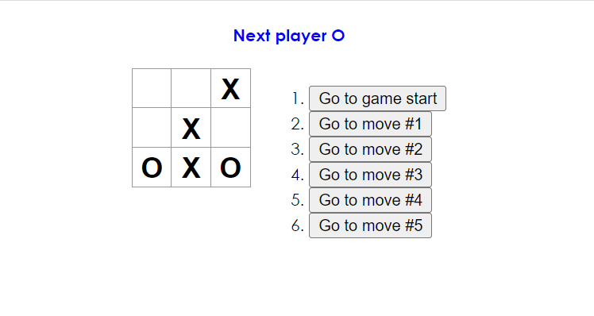

# Tic Tac Toe

This version of the game allows you to:
- play tic-tac-toe,
- shows when one of the players has won,
- stores the history of the game,
- allows players to view the history of the game and see past states of the playing field.

To see the project click on the picture below 

